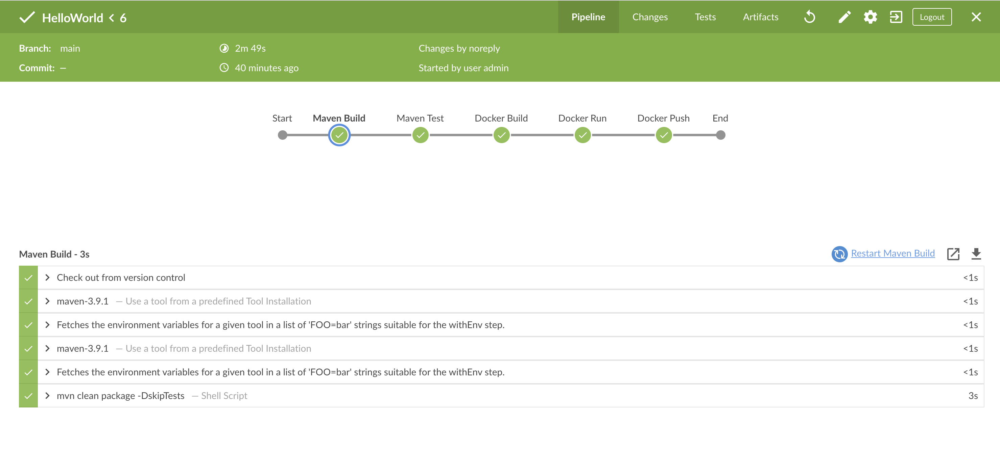

# HelloWorld

## Table of Contents

- [Introduction](#Introdcution)
- [Maven Build and Test](#maven-build-and-test)
- [Execute the Jar file](#execute-the-jar-file)
- [Docker Build and Run](#docker-build-and-run)
- [Jenkins Pipeline](#jenkins-pipeline)

## Introduction

This project demonstrates the use of **Java**, **JUnit4**, **Maven**, **Docker** and **Jenkins pipeline** in a simple HelloWorld app. 
The project also makes use of github workflows to automate testing on the Pull requests. 

## Maven Build and Test

To run a Maven Build and trigger Unit Tests, run the below commands in the project's root folder.

```bash
# Maven build
mvn clean package -DskipTests

# Maven test
mvn test
```

## Execute the Jar file

Once the Maven build succeeds, a `HelloWorld-1.0-SNAPSHOT.jar` is generated in the `target` directory.
To execute the jar, run the below command.

```bash
java -jar /HelloWorld/target/HelloWorld-1.0-SNAPSHOT.jar
```

## Docker Build and Run

This repository also contains a `Dockerfile` which can be used to build a docker image which can be executed.
To build the docker image, simply run the below command in the root folder of this project.

```bash
# Build the docker image
docker build -t hello-world:1.0 .

# Run the docker image
docker run hello-world:1.0
```

```bash
# Output of docker run command
Hello World!
```

## Jenkins Pipeline

The project also contains a `Jenkinsfile` which performs maven build and test, docker build and run and then pushes the image into the `dockerhub` registry.

The docker image pushed by the Jenkins pipeline can be found [here](https://hub.docker.com/repository/docker/nanayak/hello-world/general).

